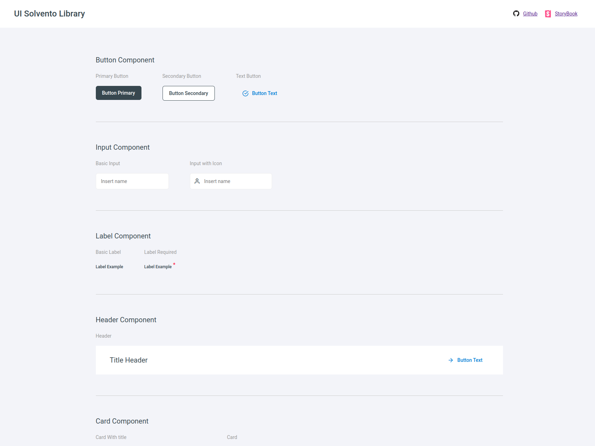
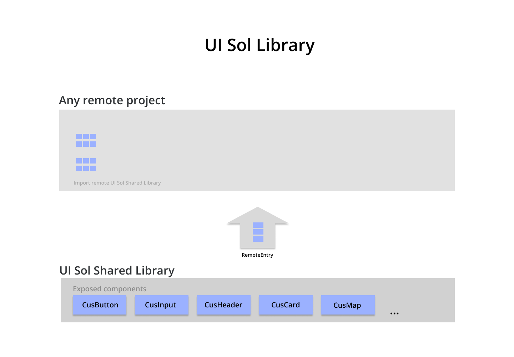

# UI shared library

## Table of Contents
1. [General Info](#general-info)
2. [Technologies](#technologies)
3. [Installation for Development](#Installation-for-Development)
3. [Installation with docker image](#Installation-with-docker-image)

## General Info
We have here a user interface library with reusable atomic components to build beautiful user interfaces quickly.

🔵 View project running: [sol-ui-shared-library](https://sol-shared-library.netlify.app/#/)



#### Important 📢:
you should know that this project uses the **microfrontend** architecture making use of *module federation*, the components are exposed so that they can be used in other projects to build user interfaces quickly.

Here you can see a small scheme to better understand the architecture of this project.



## Technologies
A list of technologies used within the project:
* [VueJS](https://vuejs.org/): Version 3.2.13 
* [Webpack](https://webpack.js.org/): Version 5.89.0
* [Node.js](https://nodejs.org/): Version 16.0.0

## Installation for Development

#### Clone project
```
git clone https://github.com/andybolano/sol-shared-library.git
```
#### 📁 Move to the project directory 
```
cd shared-library
```

#### 🛠️ Install dependencies
```
npm install
```

#### 🏁 Compiles and hot-reloads for development
```
npm run serve
```

The project is configured by default to run on **port 8081**, so you should view it at the following address on your computer [http://localhost:8081/](http://localhost:8081/) 🏁.

## Installation with docker image 🐋


```
$ git clone https://github.com/andybolano/sol-shared-library.git
$ cd shared-library
$ ./start.sh
```
if you are using linux environment and you have permissions problems when executing the command ./start.sh
```
chmod +x start.sh
```

The project is configured by default to run on **port 8081**, so you should view it at the following address on your computer [http://localhost:8081/](http://localhost:8081/) 🏁.
